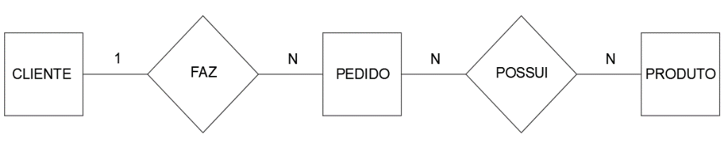
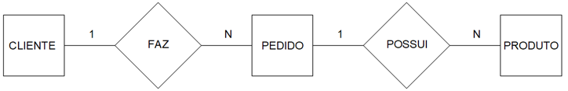
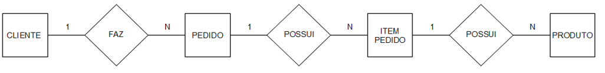
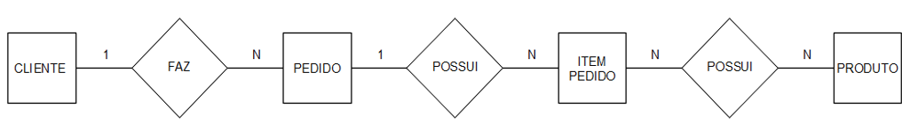
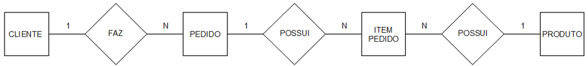

# Revisão Gestão e Análise de Dados 11/08/2026

## Questão 2 (Banco de Dados - Notação Peter Chen)

Leia o texto a seguir.

`A estrutura lógica global de um banco de dados pode ser expressa graficamente por um diagrama de entidades (representado por retângulos), por relacionamentos (representados por losangos) e pelos atributos de cada entidade ou relacionamento por meio de elipses (notação Peter Chen). A conectividade descreve as restrições no mapeamento das associações existentes entre as ocorrências de entidades em um relacionamento. Os valores de conectividade estão sempre entre um ou muitos em um dos lados do relacionamento.`

MACHADO, F. N. R. **Banco de Dados: projeto e implementação**. São Paulo: Érica, p. 74, 2020 (com adaptações).

A partir das informações do texto, considere que uma empresa mantém o controle de seus pedidos em uma planilha eletrônica, armazenando as informações de clientes, pedidos e produtos conforme a figura a seguir.

| A | B | C | D | E | F | G | H | I | J | K |
|-------|------|--------|--------|----------|-------|-------|-------|--------|-------|-------|
| Cliente | CPF | Endereço | Telefone | Nro. Pedido | Data | Valor Total Pedido | Nro. Item Pedido | Produto | Qtd. | Valor unitário |

Com o crescimento das vendas, a empresa decidiu migrar as informações para um banco de dados e utilizar um sistema para o cadastro dos pedidos. Diante do exposto, assinale a alternativa que apresenta corretamente o diagrama da estrutura lógica do banco de dados a ser implementado na empresa, seguindo regras de normalização.

a)  

b)

c)  

d)  

e)  

### Conteúdo:

Enunciado sobre a modelagem de uma planilha de controle de clientes, pedidos e produtos utilizando a notação de Peter Chen e regras de normalização.

### Gabarito:

Alternativa E

### Justificativa:

A alternativa E modela corretamente as relações e cardinalidades entre as entidades (Cliente faz Pedidos [1:N]; Pedido possui Itens Pedido [1:N]; Item Pedido possui Produto [N:1])
