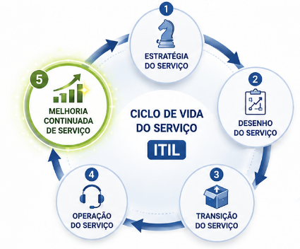

# Revisão Governança da Informação e da Tecnologia 18/08/2026

## ITIL - Melhoria Continuada de Serviço

#### TOMO 5- Questão 7

Leia o texto a seguir.

`Os serviços de Tecnologia da Informação (TI) podem ser melhorados em relação ao seu Ciclo de Vida do Serviço, no alinhamento do Portfólio de TI com os requerimentos atuais e futuros e com o aumento da maturidade das entregas dos processos em cada Serviço de TI. No Information Technology Infrastructure Library (ITIL), essa melhoria ocorre na etapa de Melhoria Continuada de Serviço.`

FREITAS, M. A. S. **Fundamentos do gerenciamento de serviços de TI**. Rio de Janeiro: Brasport, 2013 (com adaptações).

Considerando o ciclo de vida do serviço descrito, a etapa de Melhoria Continuada de Serviço do ITIL

a.  descreve a fase do ciclo de vida responsável pelas atividades do dia a dia, orientando sobre como garantir a entrega e o suporte a serviços de forma eficiente e eficaz em ambientes operacionais gerenciados.

b.  orienta, através de princípios, práticas e métodos de gerenciamento da qualidade, sobre como aprimorar a qualidade do serviço, incluindo as metas de eficiência operacional e a continuidade do serviço.

c.  orienta sobre como visualizar o gerenciamento de serviços não somente como uma capacidade organizacional, e sim como ativo estratégico, descrevendo princípios úteis para criar políticas, diretrizes e processos de gerenciamento.

d.  orienta sobre como implantar serviços novos e modificados para ambientes operacionais gerenciados, detalhando os processos de planejamento, gerenciamento de mudanças, gerenciamento da configuração e gerenciamento de liberação.

e.  fornece orientação para o desenvolvimento dos serviços e das práticas de gerenciamento de serviços, propondo mudanças e melhorias necessárias para manter ou agregar valor aos clientes ao longo do ciclo de vida do serviço.

### Resposta: 

- Alternativa "B"

### Justificativa:

A - Alternativa incorreta.

JUSTIFICATIVA. A fase do ciclo de vida responsável pelas atividades do dia a dia, que orienta sobre como garantir a entrega e o suporte a serviços de forma eficiente e eficaz em ambientes operacionais gerenciados, é conhecida como operação de serviço.

B - Alternativa correta.

**JUSTIFICATIVA. A melhoria contínua envolve todos os elementos do sistema de valor de serviço (SVS) do ITIL e as práticas e os serviços da organização destinados a atender as necessidades de negócios. Isso é feito por meio da avaliação e da melhoria contínua de cada elemento envolvido na gestão de produtos e serviços.**

C - Alternativa incorreta.

JUSTIFICATIVA. A estratégia de serviço visualiza o gerenciamento de serviços como um ativo estratégico e descreve os princípios inerentes à prática dessa disciplina, que são úteis para criar políticas, diretrizes e processos de gerenciamento de serviços ao longo do ciclo de vida.

D - Alternativa incorreta.

JUSTIFICATIVA. A transição de serviços orienta sobre como implantar serviços novos e modificados para ambientes operacionais gerenciados, detalhando os processos de planejamento, gerenciamento de mudanças, gerenciamento da configuração e gerenciamento

de liberação.

E - Alternativa incorreta.

JUSTIFICATIVA. O desenho de serviços fornece orientação para o desenvolvimento dos serviços e das práticas de gerenciamento de serviços, propondo mudanças e melhorias necessárias para manter ou agregar valor aos clientes ao longo do ciclo de vida do serviço.
