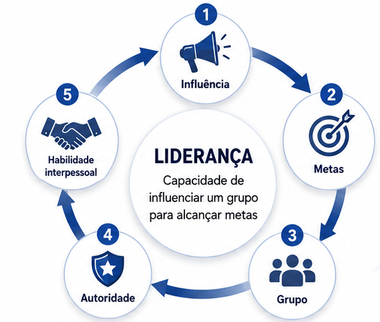

# Revisão Gestão Ágil de Projetos 25/08/2026

## Questão 2 (Liderança em Projetos de TI)

Leia o texto a seguir.

`Pode-se definir liderança como a capacidade de influenciar um grupo para alcançar metas. A origem dessa influência pode ser formal, como a que é conferida por um alto cargo na organização. Como essas posições remetem a um certo grau de autoridade, uma pessoa pode assumir um papel de liderança apenas em função do cargo que ocupa. Nem todos os líderes são administradores e nem todos os executivos são líderes. O fato de a organização conferir a seus executivos alguns direitos formais não lhes assegura a capacidade de liderança eficaz. A liderança não sancionada – aquela capaz de influenciar os outros, que emerge fora da estrutura formal da organização – geralmente é tão importante quanto a influência formal, ou até mais. Em outras palavras, o líder pode surgir naturalmente dentro de um grupo ou por indicação formal. Nesse sentido, uma das habilidades interpessoais cujo valor é alto para as organizações é a liderança.`

ROBBINS, S. P. **Comportamento organizacional**. 11. ed. São Paulo: Prentice Hall, 2009 (com adaptações).

Considerando essas informações, assinale a opção em que se caracteriza corretamente a liderança na área de projetos.

A. Gestores de projetos devem prezar pelo desenvolvimento das habilidades interpessoais dos membros de seu grupo, como a liderança e o trabalho em equipe, essenciais para o sucesso dos projetos e o alcance dos objetivos estratégicos.

B. Líderes com perfis mais autocráticos têm maior chance de sucesso no gerenciamento de projetos, visto que essa é uma atividade fundamental para que os objetivos estratégicos das organizações sejam alcançados.

C. Líderes devem matar o *status quo*, pois sua posição é resultado de uma escolha da administração que eles devem representar, cabendo-lhes fazer com que os objetivos estratégicos sejam alcançados e os projetos sejam entregues no prazo, dentro do escopo planejado, respeitando as estimativas orçamentárias.

D. Líderes de projetos devem ter como características pessoais determinação, confiança e vontade, sendo-lhes dispensáveis as habilidades técnicas, pois elas podem ser desempenhadas pelos membros da equipe.

E. Profissionais do tipo introspectivo são inadequados para funções de liderança, pois as teorias modernas de gerenciamento de projetos consideram a comunicação como um dos principais papéis do líder.

### Resposta

Alternativa A

### Justificativa:

A - Alternativa correta.

JUSTIFICATIVA. As habilidades interpessoais são fundamentais para o bom funcionamento de uma equipe. Equipes em que muitos dos seus membros têm dificuldades nessa área podem se tornar palco para brigas e discussões desnecessárias, além de frequentemente terem problemas de comunicação.

B - Alternativa incorreta.

JUSTIFICATIVA. A liderança autocrática é um dos tipos mais comuns de liderança encontrados nas organizações. Um dos problemas oriundos desse tipo de liderança é que o chefe tende a ser centralizador, ignorando as opiniões de subordinados e demais pessoas envolvidas no projeto. Os membros da equipe do projeto podem se sentir diminuídos e desmotivados diante dessa situação, o que tende a levar a um baixo desempenho. Por isso, esse tipo de liderança costuma ser desencorajado.  

C - Alternativa incorreta.

JUSTIFICATIVA. O próprio texto do enunciado mostra que nem toda liderança é sancionada, não sendo sempre o resultado de uma escolha administrativa. Em muitos casos, a liderança pode surgir naturalmente, por exemplo, devido ao elevado grau de conhecimento de um profissional sobre determinado assunto em uma situação específica.

D - Alternativa incorreta.

JUSTIFICATIVA. Mesmo não sendo diretamente responsável pela execução do trabalho técnico, é importante que o líder de um projeto seja capaz de entender e avaliar a sua natureza. Um bom conhecimento técnico permite que o líder compreenda as demandas que estão sendo colocadas sobre a sua equipe e identifique a qualidade do seu trabalho. Além disso, líderes que apresentam elevado conhecimento de uma área tendem a ser respeitados e admirados pelos membros da sua equipe, exatamente por causa desse conhecimento.

E - Alternativa incorreta.

JUSTIFICATIVA. Profissionais com perfis mais introspectivos não precisam ter, necessariamente, problemas de comunicação. Além disso, dependendo da natureza do trabalho e da área, é comum que a maioria dos profissionais tenha um perfil mais introspectivo. Adicionalmente, é possível que suas habilidades de comunicação sejam adequadas ou até mesmo muito boas. O tipo de liderança e o perfil do líder podem ser diferentes para projetos e áreas de atuação distintas. Assim, a introspecção pode ser adequada em alguns contextos e inadequada em outros.
