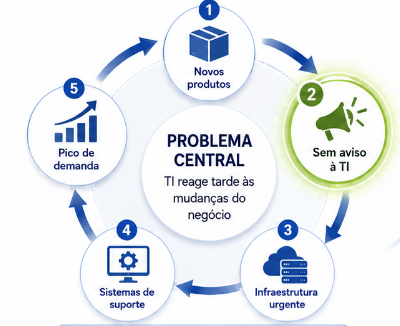

# Revisão Governança da Informação e da Tecnologia 01/09/2026

## Governança de TI - Alinhamento Estratégico

#### TOMO 6 - Questão 7

Leia o texto a seguir.

`A unidade de TI de determinada empresa é vista como ruim, pois não produz níveis de serviços adequados. Há alguns meses, após a fusão dessa empresa com uma outra do mesmo ramo, foi nomeado um novo executivo, que se sente preocupado com o desempenho da unidade de TI e pretende melhorá-lo. Uma questão contínua é que novos produtos da empresa são introduzidos sem que a equipe de TI seja avisada, o que força situações que exigem construção de infraestrutura e elaboração dos sistemas de suporte necessários. Pelo fato de os produtos da empresa acumularem muitos dados e haver muitos clientes, um novo produto pode implicar em um aumento repentino da demanda por serviços de infraestrutura de TI. É caro e difícil satisfazer essa demanda para esse fim específico, e os resultados alcançados têm gerado insatisfação contínua em relação à unidade de TI.`

HUNTER, R.; WESTERMAN, G. **O verdadeiro valor de TI**. São Paulo: M. Books, 2011 (com adaptações).

Com base nessa situação, avalie as asserções e a relação proposta entre elas.

|  |  |
|----|----|
| I. | A criação de um comitê composto exclusivamente pelo pessoal da área de TI, com autonomia para tomar as decisões que afetam as demandas por serviços e infraestrutura de TI, seria uma opção acertada. |

**PORQUE**

|  |  |
|----|----|
| II\. | A empresa possui um arranjo decisório inadequado para suas expectativas; a pouca credibilidade da área de TI e a falta de envolvimento dessa área nas decisões comprometem o alinhamento estratégico entre a TI e o negócio, problema relacionado à governança de TI. |

A respeito dessas asserções, assinale a opção correta.

A. As asserções I e II são proposições verdadeiras, e a asserção II justifica a I.

B. As asserções I e II são proposições verdadeiras, e a asserção II não justifica a I.

C. A asserção I é uma proposição verdadeira, e a II é uma proposição falsa.

D. A asserção I é uma proposição falsa, e a II é uma proposição verdadeira.

E. As asserções I e II são proposições falsas.

### Resposta:

- Alternativa "D" (Asserção I é falsa, e a II é verdadeira)

### Justificativa:

I - Asserção falsa.

JUSTIFICATIVA. A criação de um comitê com membros que pertençam exclusivamente à área de TI não promove a integração entre a área de TI e o restante da empresa. Devemos nos lembrar de que a função principal da governança de TI é alinhar a TI aos negócios, a fim de que a organização alcance seus objetivos estratégicos.

II\. Asserção verdadeira.

JUSTIFICATIVA. Está claro que o arranjo decisório da empresa é equivocado. A empresa jamais terá seus objetivos alcançados se o lançamento de cada produto for feito sem que a área de TI tenha conhecimento. É improvável imaginar que a área de TI será capaz de atender às necessidades de um novo produto ou de um novo serviço sem ter conhecimento prévio da sua necessidade ou mesmo da sua existência.

Alternativa correta: D.
