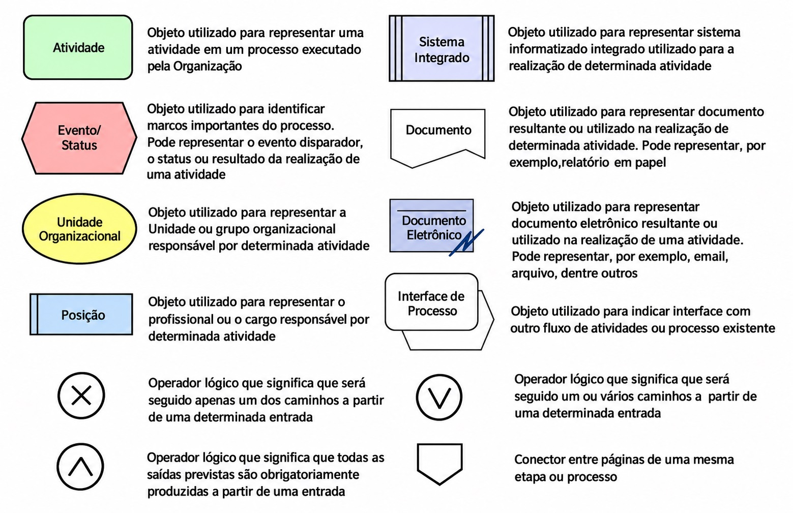

# Revisão Gestão Ágil de Projetos- 13/10/2026

#### TOMO 9 - Questão 1

::: {.alert .alert-info}
A linguagem gráfica **EPC/ARIS** é utilizada para modelar processos de negócios.

Para isso, utiliza diversos recursos para descrever, representar ou indicar, por exemplo, atividades, funções, processos e fluxos. Nesse contexto, avalie as afirmativas a seguir.

-   

    I.  A **ligação entre dois processos** é indicada por um **conector**.

-   

    II. A **descrição de um processo** deve **iniciar e terminar em um evento**.

-   

    III. As **funções**, ou **atividades**, são representadas por um **retângulo com bordas arredondadas**.
:::

É correto apenas o que se afirma em

|     |           |
|-----|-----------|
| A.  | I.        |
| B.  | II\.      |
| C.  | III\.     |
| D.  | I e II.   |
| E.  | II e III. |

**Avaliação da Questão:**

::: alert-warning
*`Processo`*

Processo é a colaboração de várias atividades comuns para a realização de um objetivo global, focado no cliente final. O EPC (Event-Driven Process Chain) é um modelo de representação de processos baseado no controle de fluxos de atividades e eventos. As atividades correspondem às tarefas executadas e os eventos correspondem ao início e ao fim da realização de uma atividade. A cadeia de processos orientada por eventos faz parte da arquitetura ARIS (Architecture of Integrated Information Systems). No EPC, as atividades (representadas por retângulos com bordas arredondadas) e os eventos (representados por hexágonos) podem ser conectados utilizando os operadores lógicos, que apresentam as dependências de uma ou de mais atividades para a realização da próxima atividade, para o paralelismo na execução das atividades e para a determinação dos caminhos opcionais que um processo pode seguir após realizar uma atividade.

Na figura 1, apresentamos os principais elementos utilizados na modelagem EPC.
:::

### Resposta: 

- Alternativa "E"

## Referências
- ALVES, A. Sistema Web para apoio às análises de dados de um calorímetro de altas energias. Rio de Janeiro: UFRJ, 2009.

- CAMEIRA, R. Hiper-integração: Engenharia de processos, arquitetura integrada de sistemas componetizados em agentes e modelos de negócios tecnologicamente habilitados. Tese de Doutorado em Engenharia de Produção – Rio de Janeiro: COPPE-UFRJ, 2003.

- DAVIS, R. Business process modelling with ARIS. London: Springer, 2001.

